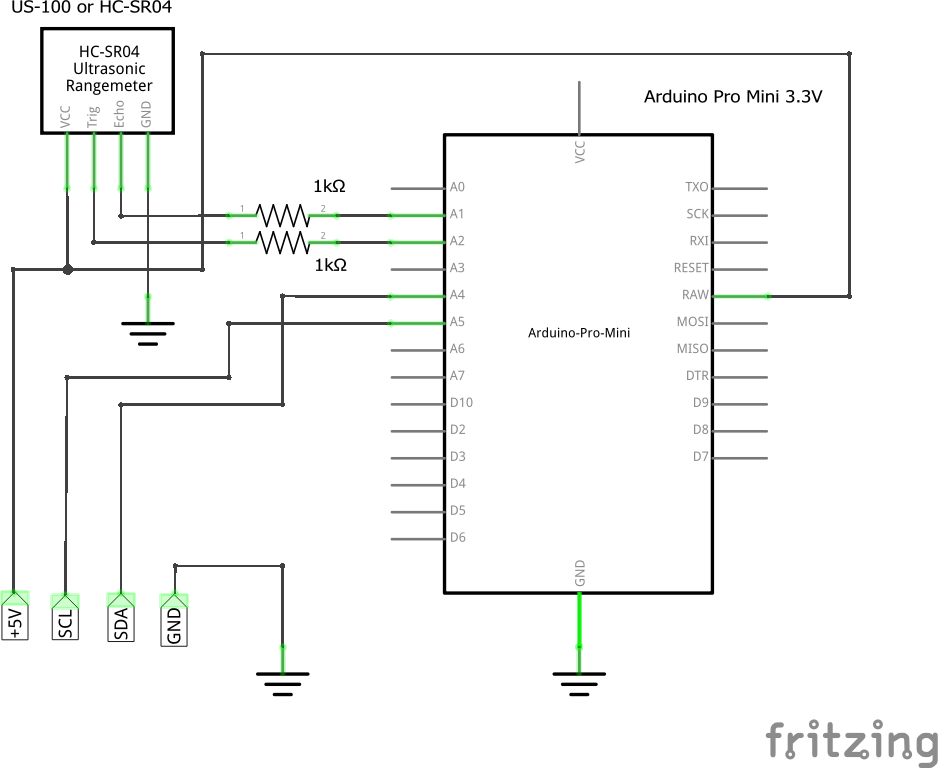

# INAV Rangefinder Interface

## Required parts

1. Arduino Pro Mini or Arduino Nano. In both cases 3.3V is advised although 5V version will work. Yet it will put 5V on the STM32 I2C lines what can be stresful for the main CPU
1. Trigger/Echo sonar module. Supported hardware:
    1. **US-100** - recommended
    1. **HC-SR04** - not recommended since produces good quality data only on very short distance over solid surface like concrete
    1. **URM-37** - not recommended, very unstable readouts
1. 2 1kOhm resistor required only when 3.3V Arduino is used



## Build & Configuration

If you are using a non seral version, open the
inav_rangefinder/inav_rangefinder.ino file in the Arduino IDE. For the
sersial version open the
inav_rangefinder_us100_serial/inav_rangefinder_us100_serial.ino
file. Set the Tool->Board you are using, the port it is on.

Look in the code for the #defines for the hardware you are using. It
will look like:

```
#define USE_US100
// #define USE_HCSR04
// #define USE_URM37
```

Uncomment the hardware you will be using, compile and flash.

## US-100 instead of HC-SR04

**US-100** is superior to HC-SR04 in almost all areas. While HC-SR04 interface is doable, it is _HIGHLY_ recommended to use US-100 instead! 

On a hardware level, connection is the same: Echo and Trigger pin. Condition is to switch US-100 to _trigger/echo_ by removing a jumper in be back of the board. When jumper is removed, US-100 will behive almost exactly like HC-SR04.  


## INAV Configuration

INAV 2.0 supports this hardware when `INAV I2C` rangefinder hardware is selected

## Notes

* HC-SR04 is 5V, while STM32 CPU are 3.3V devices and might not tolerate 5V on I2C lines. This is why, you either have to run ATtiny on 3.3V or run it on 5V too (remove inline resistors) but connect using logic level shifters
* US-100 can work in both 3.3V and 5V mode. 3.3V mode was not tested, that is why inline resistors are in place
* Latest Arduino IDE (suggested 1.8.x, should work with older)
